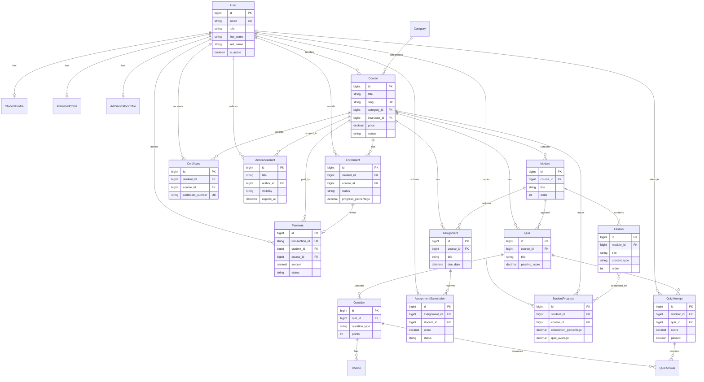

# HALMS Entity Relationship Diagram

## Key Relationships

1. **User → Profile**: One-to-one based on role (Student/Instructor/Admin)
2. **Course → Module → Lesson**: Hierarchical content structure
3. **Student → Enrollment → Course**: Many-to-many through enrollment
4. **Student → StudentProgress → Course**: Progress tracking per enrollment
5. **Course completion → Certificate**: Auto-generated at 100% progress
6. **Payment → Enrollment**: Payment confirms enrollment for paid courses
